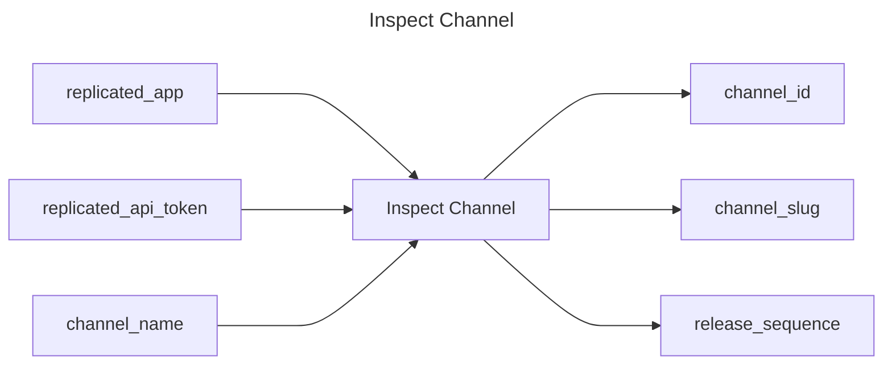

# Inspect Channel

```mermaid
---
title: Inspect Channel
---
graph LR
inspect_channel["Inspect Channel"]
replicated_app ---> inspect_channel
replicated_api_token ---> inspect_channel
channel_name ---> inspect_channel
inspect_channel ---> channel_id
inspect_channel ---> channel_slug
inspect_channel ---> release_sequence
```